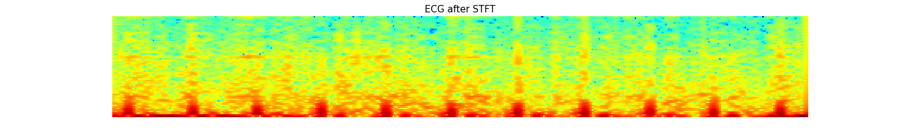

# 12leadECG-ptbxl

## Preparing Dataset
1. Download: wget -r -N -c -np https://physionet.org/files/ptb-xl/1.0.1/
2. Move `physionet.org` file to input folder

## Data formats
1. Raw 1-d signal

2. 2-d Spectrogram (Short-Time Fourier Transform, STFT)

3. 2-d Scalogram (Continuous Wavelet Transform, CWT)


## Training
### Training options
```shell script
> python train.py -h
usage: train.py [-h] [--num_workers NUM_WORKERS] [--batch_size BATCH_SIZE]
                [--device DEVICE] [--val_index VAL_INDEX] [--epoch EPOCH]
                [--model_config_name MODEL_CONFIG_NAME] [--save_dir SAVE_DIR]
                [--target_label TARGET_LABEL] [--data_type DATA_TYPE]
                [--fs FS] [--upsampling_factor UPSAMPLING_FACTOR]
                [--sig_scaling SIG_SCALING] [--nperseg NPERSEG]
                [--t_len T_LEN] [--stft_scaling STFT_SCALING]
                [--width_min WIDTH_MIN] [--width_max WIDTH_MAX]
                [--width_inc WIDTH_INC] [--wavelet WAVELET_TYPE]
                [--cwt_scaling CWT_SCALING] [--cwt_resize CWT_RESIZE]
                [--cwt_width CWT_WIDTH] [--cwt_height CWT_HEIGHT]

optional arguments:
  -h, --help            show this help message and exit
  --num_workers NUM_WORKERS
                        Number of workers for dataloader multi-processing
                        (default: 8) (default: 8)
  --batch_size BATCH_SIZE
                        Batch size (default: 8) (default: 8)
  --device DEVICE       Torch Device (default: cuda:0) (default: cuda:0)
  --val_index VAL_INDEX
                        Validation index # between 1-10 (default 1) (default:
                        1)
  --epoch EPOCH         EPOCH (default: 30) (default: 30)
  --model_config_name MODEL_CONFIG_NAME
                        Filename for model config json file (default: None)
  --save_dir SAVE_DIR   Save directory (default: None)
  --target_label TARGET_LABEL
                        Target class (diagnostic, form, rhythm,
                        diagnostic_class, diagnostic_subclass, all), (default:
                        diagnostic) (default: diagnostic)
  --data_type DATA_TYPE
                        Data type (signal, stft, cwt), (default: signal)
                        (default: signal)
  --fs FS               sampling frequency (100, 500), (default: 500)
                        (default: 100)
  --upsampling_factor UPSAMPLING_FACTOR
                        resampling (upsampling) factor for signal (default: 1)
                        (default: 1)
  --sig_scaling SIG_SCALING
                        signal scaling (minmax, standard, both, None)
                        (default: None)
  --nperseg NPERSEG     nperseg for STFT (default: 128) (default: 128)
  --t_len T_LEN         time-length for STFT (default: 500) (default: 500)
  --stft_scaling STFT_SCALING
                        signal scaling (min_max, standard, both, None)
                        (default: None)
  --width_min WIDTH_MIN
                        minimum width (default: 0.1) (default: 0.1)
  --width_max WIDTH_MAX
                        maximum width (default: 30.1) (default: 30.1)
  --width_inc WIDTH_INC
                        width increment unit (default: 0.1) (default: 0.1)
  --wavelet WAVELET_TYPE
                        wavelet type (ricker, morlet2), (default: ricker)
                        (default: ricker)
  --cwt_scaling CWT_SCALING
                        signal scaling (min_max, standard, both, None)
                        (default: None)
  --cwt_resize CWT_RESIZE
                        cwt resize or not? (default: False) (default: False)
  --cwt_width CWT_WIDTH
                        cwt resize width (default: 1000) (default: 1000)
  --cwt_height CWT_HEIGHT
                        cwt resize height (default: 300) (default: 300)
```

### Example Usage: 
> python ./codes/train.py --data_type signal --fs 100 --num_workers 16 --model_config_name ./config/test1d.json --device cuda:1 --batch_size 32 --target_label all